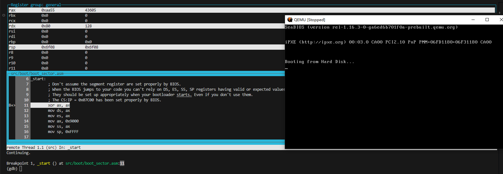
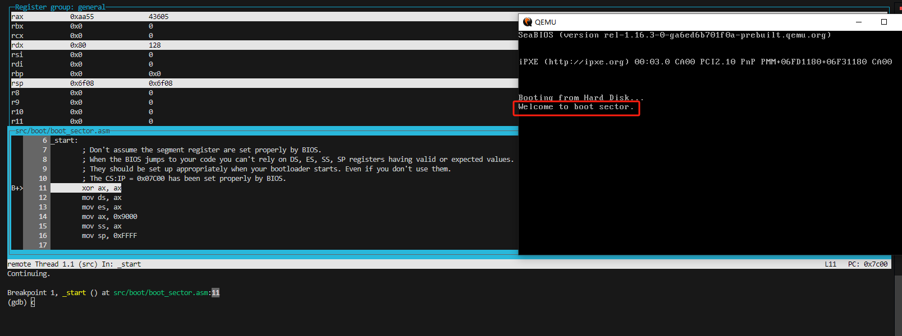

# super-tiny-bios-boot_sector

## Project Demo



## You need to install some software.

```
$ make -v
GNU Make 4.4.1
Built for x86_64-w64-mingw32
Copyright (C) 1988-2023 Free Software Foundation, Inc.
License GPLv3+: GNU GPL version 3 or later <https://gnu.org/licenses/gpl.html>
This is free software: you are free to change and redistribute it.
There is NO WARRANTY, to the extent permitted by law.
```

```
$ nasm -v
NASM version 2.16.03 compiled on Apr 17 2024
```

```
$ ld.lld -v
LLD 19.1.7 (https://github.com/llvm/llvm-project.git cd708029e0b2869e80abe31ddb175f7c35361f90) (compatible with GNU linkers)
```

```
$ qemu-system-x86_64 --version
QEMU emulator version 9.2.50 (v9.2.0-13622-g3429737367-dirty)
Copyright (c) 2003-2025 Fabrice Bellard and the QEMU Project developers
```

```
$ gdb -v
GNU gdb (GDB) 15.2
Copyright (C) 2024 Free Software Foundation, Inc.
License GPLv3+: GNU GPL version 3 or later <http://gnu.org/licenses/gpl.html>
This is free software: you are free to change and redistribute it.
There is NO WARRANTY, to the extent permitted by law.
```

## Start running.

```
$ make debug
```

## References

1. https://makefiletutorial.com/
2. https://www.nasm.us/xdoc/2.16.03/html/nasmdoc0.html
3. https://lld.llvm.org/
4. https://stackoverflow.com/questions/33603842/how-to-make-the-kernel-for-my-bootloader
5. https://github.com/dibingfa/flash-linux0.11-talk
6. https://stackoverflow.com/questions/32127524/how-to-install-and-use-make-in-windows
